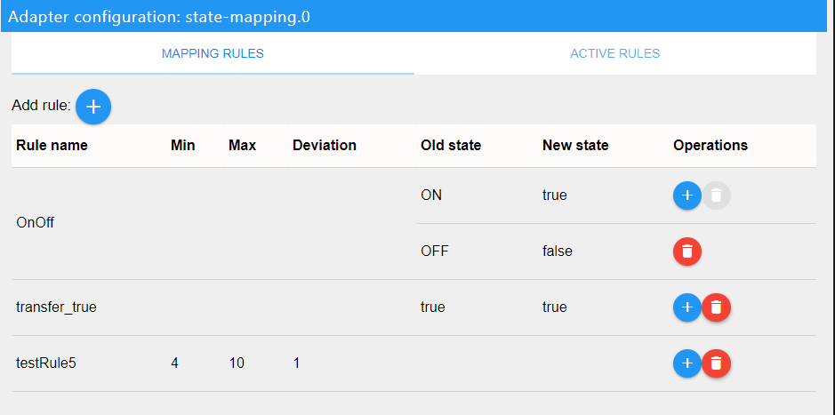

ioBroker state mapping adapter
==============

# Copy state from/to another state

This adapter allows you to copy updated value from one state to another.

# Getting started
In instance settings there are two pages.

## Mapping rules
If you want to convert values, you need to create rules.
 
Click, Add rule. Each rule may have multiple mappings, use blue plus in Operations column to add additional mapping. Set rule name, value will be converted from old state to new state. For example, your device sends ON or OFF to mqtt topic, and you need to convert this to boolean true/false and copy to other state.

## Active rules
On Active rules page you can see all objects with rules, add new object, edit and delete it.

# Configure your objects
Click settings on your object and check enable. In rule field you can enter name of mapping rule, that you created before. If value is number, you can set correction. For example, if you set -1, your value will be decrease by 1 each state update.
If you want just copy value to your state, set source object name in "Input" field.
If you need copy value from your object to another state, use "Output" field. Set destination state in this field.
And if you want two-way copy, set object name to "Input and output field".
It is not recommended to set all three fields at some time. Use "Input"/"Output" fields or only "Input and output" field.
